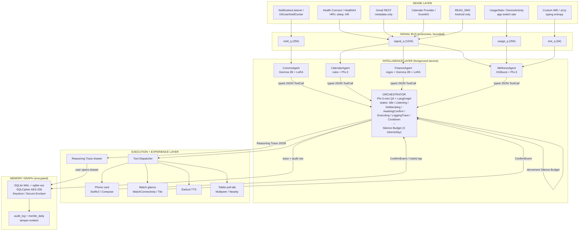

# Aura — Architecture

Single-file authoritative architecture summary. Cross-reference: `plan.md` §10–§14, `technical_spec.md` §1–§6.

Document version: 1.0
Last updated: 2026-05-07

---

## 1. Scope and intent

Aura is an on-device, multi-agent empathetic intelligence layer for Indian Gen Z and Gen Alpha users. The architecture is locked to three layers, four specialist agents, one orchestrator, one memory graph, and two cross-cutting components — a Reasoning Trace and a Silence Budget. Every cross-process boundary is named. Every persistence boundary is encrypted. No data leaves the device without an explicit user-initiated action (`plan.md` §20.3).

This document is the engineering source of truth. `plan.md` describes intent and product framing; `technical_spec.md` describes contracts and code shapes; this file fixes the structural decomposition both depend on.

---

## 2. The three layers

The system is decomposed into Sense, Intelligence, and Experience. Each layer has a single contract with the next; cross-layer calls are typed.

### 2.1 Sense Layer — signal acquisition

The Sense Layer is the only layer permitted to read OS sensors, OAuth-scoped cloud APIs, and user-installed-app artefacts (notifications, calendar entries, SMS). It emits structured signal records onto a bounded in-process queue and never persists raw bodies.

Inputs (`plan.md` §10.1, `technical_spec.md` §1):

- Health Connect (Android) / HealthKit (iOS): HRV (RMSSD), sleep, HR, steps.
- NotificationListenerService (Android) / UNUserNotificationCenter (iOS, own app only).
- UsageStatsManager (Android) / DeviceActivityCenter (iOS, limited).
- Custom IME (iOS) / AccessibilityService (Android): typing entropy only, never characters.
- Gmail REST API: thread metadata under `gmail.metadata` and `gmail.readonly` scopes.
- Google Calendar (Android) / EventKit (iOS).
- SMS (`READ_SMS` permission, Android only — iOS does not permit programmatic SMS read).
- Fused Location Provider / CoreLocation: bucketed to a 200 m grid for behaviour patterns; raw coordinates only retained in the last hour.
- AudioRecord / AVAudioRecorder: 1-second windows for ambient level only, never persisted as audio.

Privacy invariants enforced at this layer:

- Raw message bodies are never written to disk after agent processing.
- Audio is captured for level only; no transcripts are stored.
- Location is bucketed and aged out.
- Every signal carries a freshness timestamp; the orchestrator may mark a tick `signal_freshness=stale` if a sample exceeds its window.

### 2.2 Intelligence Layer — agents and orchestrator

The Intelligence Layer reads from the signal bus and writes typed JSON tool calls to the Experience Layer. It is a single foreground service hosting four agents and the orchestrator. Inter-agent communication is never free-form natural language; every call is a typed JSON tool invocation through the orchestrator (`plan.md` §10.2, `technical_spec.md` §4.5).

Components:

- **CommsAgent** — Gemma 2B Q4 with a LoRA adapter. Tools: `classify`, `draft_reply`, `batch_summarize`, `snooze`, `triage_inbox`. Owns notification triage and Gmail thread summarisation. Never persists message bodies; stores only `{sender_hash, intent_label, urgency_score, ts}`.
- **CalendarAgent** — Phi-3-mini for natural-language slot suggestions; rule engine (interval tree) for conflict detection. Tools: `detect_conflicts`, `suggest_slots`, `auto_decline`, `travel_aware_alert`, `parse_ics_attachment`.
- **FinanceAgent** — Gemma 2B Q4 with a LoRA adapter for receipt and SMS parsing on unknown templates; regex bank-template pack for the twelve most common Indian banks on the hot path. Tools: `parse_sms`, `parse_gmail_receipt`, `categorize`, `anomaly_flag`, `predict_eom_balance`, `suggest_substitution`.
- **WellnessAgent** — XGBoost regressor (200 trees, depth 4) for the Load Score; Phi-3-mini-templated prose for intervention rationale. Tools: `compute_load_score`, `intervention_select`, `correlation_check`, `recovery_check`. Computes a single `load_score` in [0, 100] from nine features (`technical_spec.md` §7.1).
- **Orchestrator** — Phi-3-mini Q4 instance running a LangGraph state machine. States: `Idle → Listening → Deliberating → AwaitingConfirm → Executing → LoggingTrace → Cooldown → Idle`. Owns the candidate-action ranking, the daily Silence Budget, the Reasoning Trace emission, and all Experience-layer dispatch.

Shared agent contract: every agent runs on-device, targets a `tick()` median latency of 300 ms (p95 700 ms), emits a Reasoning Trace fragment for any output that can trigger an Experience surface, respects the global Do-Not-Disturb window, and is fully unit-testable with synthetic input fixtures committed to the repo.

### 2.3 Experience Layer — surfaces

The Experience Layer translates the orchestrator's typed tool call into a user-facing event and reports outcomes back. It hosts no business logic.

Surfaces (`plan.md` §10.3):

- Phone hero: SwiftUI / Compose card stack with Morning Brief, Action card, Reasoning Trace drawer, Memory tab.
- Watch glance: WatchConnectivity (iOS) / Wear OS Tile (Android) one-line nudge with a single haptic, capped to confirm/dismiss interactions.
- Earbud whisper: AVSpeechSynthesizer / Android TextToSpeech, capped at one TTS per active session.
- Tablet / laptop pull-tab: Multipeer Connectivity (iOS) or Nearby Connections (Android) over local network with a 6-digit pairing code.

Every surface is reversible. Every surface emits a `ConfirmEvent` back to the orchestrator that is persisted on the originating Reasoning Trace as the `outcome` field.

---

## 3. The orchestrator and the four agents

The orchestrator is the single decision point. Every action that reaches the user has been ranked by the orchestrator against a `score = utility(c, user_state) − cost(c) − recent_penalty(c) − dnd_penalty(c)` formula (`technical_spec.md` §4.2). The threshold is 0.45; below it the orchestrator emits `do_nothing` and writes a trace with `reason_code=below_threshold`.

Hard caps enforced before scoring (`technical_spec.md` §4.3):

- Daily cap: at most three proactive surfaces per local day, except safety-class Wellness actions (`MUTE_*`, `BREATHE_*`).
- Window cap: at most one proactive surface in any rolling 30-minute window.
- Recovering state: zero proactive surfaces while `wellness_state == RECOVERING` for 60 minutes after entry.
- DND: surfaces during user-set DND windows are silently dropped except WATCH-class haptics for safety candidates.

Confirm-required is hard-coded per action kind (`technical_spec.md` §4.4). The orchestrator refuses to set `confirm_required=false` for any action not on the auto-execute allowlist.

---

## 4. The Reasoning Trace

The Reasoning Trace is the user-visible explanation of every action and every refusal-to-act. Schema is fixed in `technical_spec.md` §4.6 and is enforced via `jsonschema` at trace-write time. Required fields: `trace_id`, `ts`, `trigger`, `signals`, `candidates`, `chosen`, `rationale`, `confirm_required`, `outcome`.

UI rendering (`technical_spec.md` §5.3): tap on any action card opens a drawer with five sections — Why now, What I saw, What I considered, What I chose and why, What you can do.

Retention default is 30 days; user-overridable per type to 7 / 30 / 90 / 365 / never-purge. Aggregated daily counters (kind, count, accept rate, dismiss rate) are retained 365 days even after individual traces purge, used to compute long-term satisfaction without storing the traces themselves.

Redaction policy (`technical_spec.md` §5.4) covers eight field classes. `redactions[]` lists which fields were redacted but never the original values.

ADR-0004 fixes the schema, storage path, and UI rule.

---

## 5. The Silence Budget

The Silence Budget is a named state variable representing Aura's daily quota of proactive surfaces. The default value is **3 tokens per local day**. Each proactive surface decrements the budget by one token. A tap of the "useful" affordance on a surfaced card refunds one token, capped at the daily ceiling.

The Silence Budget is visible in the Settings tab as a three-dot indicator and is persisted as a settings row keyed `silence_budget_today`. It is reset at 00:00 local time. It is a Phase 2 reported KPI alongside effort reduction, task completion, autonomy quality, and stress reduction.

Safety-class Wellness actions (`MUTE_*`, `BREATHE_*`) do not consume from the Silence Budget; they are uncapped because they reduce attention rather than spend it. Calendar and Finance auto-execute surfaces (`SHOW_BRIEF`, `LEAVE_BY_ALERT`, `SURFACE_ANOMALY`, `PROJECT_BALANCE`) consume from the budget and contribute to the daily-cap enforcement above.

ADR-0003 fixes the Silence Budget definition, semantics, default value, refund rule, UI rule, and Phase 2 KPI status.

---

## 6. The memory graph

The memory graph is an on-device SQLite database with sqlite-vss vector indexing, encrypted at rest with SQLCipher under a key derived from the platform Keystore (Android) or Secure Enclave + Keychain (iOS). Schema in `technical_spec.md` §6.2.

Node types: `User`, `Event`, `App`, `Person`, `Place`, `Transaction`, `Conversation`, `HealthSnapshot`, `Action`, `Trace`. Edge types: `attended`, `sent_to`, `located_at`, `paid_to`, `talked_about`, `felt_during`, `triggered_by`, `confirmed_by_user`. Embeddings are computed only at ingest time using all-MiniLM-L6-v2 int8.

Retention defaults per type are set in `technical_spec.md` §6.6. Raw conversation bodies are never stored (retention 0 days); summaries default to 30 days. A nightly job at 03:00 local time purges expired rows.

User controls are one tap each: export to JSON, delete by node, delete by time-range, delete all, view audit log, pause writes. The audit log is append-only with a hash-chained `hash_chain` field, and a daily Merkle root is computed at 00:05 local time over the previous day's audit rows. The latest 30 roots are surfaced in Settings with copy-to-clipboard, providing tamper-evidence for any single trace via Merkle inclusion proof.

ADR-0007 fixes the encryption design.

---

## 7. Cross-cutting concerns

### 7.1 Latency budget

Reference flow: stress-driven mute, 3000 ms wall-clock from sensor sample arrival to user-visible Watch haptic plus phone card. Stage breakdown in `technical_spec.md` §2. Dominant cost is LLM token generation at ~1800 ms; mitigations in order are template-fallback rationale, speculative decoding, prompt compression to 512 tokens, and heavy-fallback gating on battery and RAM.

### 7.2 Device-capability tiers

Tier A (≥8 GB RAM, e.g. iPhone 14 Pro, S22 Ultra): Llama-3-8B Q4 promoted on charge above 50%, otherwise Phi-3-mini. Tier B (6–8 GB, e.g. iPhone 14, S22 base): Phi-3-mini orchestrator plus Gemma 2B with hot-swapped LoRA adapters. Tier C (4–6 GB, e.g. mid-range Galaxy A): Gemma 2B for orchestration, rule plus DistilBERT for agents, no LoRA reply generation. Tier D (<4 GB): unsupported. ADR-0002 records the orchestrator-model decision.

### 7.3 Platform parity

Production target is the Galaxy ecosystem; Phase 1 and Phase 2 reference build is iOS because the team owns Apple devices and the total budget is ₹2,000 (`plan.md` §21). Every Sense Layer API has a 1:1 Android-iOS map (`plan.md` §10.1, deck slide 4a). ADR-0006 records the Apple-only Phase 1+2 strategy.

### 7.4 Threat model

STRIDE per surface in `threat_model.md`, with concrete mitigations per adversary class: malicious accessibility app, malicious notification listener, OS account compromise, lost device, parental coercion. The panic-wipe gesture (5-tap power button within 3 seconds) wipes the SQLCipher key, revokes OAuth tokens, and deletes app sandbox files. ADR-0005 records the on-device-only invariant; ADR-0007 records the encryption decision.

### 7.5 Failure modes

If an agent times out at 500 ms, the orchestrator cancels the agent future and proceeds with `agent_status=timeout`. If the LLM exceeds the 2500 ms budget, the rationale is generated from a template and the trace marks `rationale_source=template`. If the orchestrator itself times out at 1500 ms in `Deliberating`, the system forces `do_nothing` for that tick. No autonomous action is dispatched without all expected agent inputs.

---

## 8. Architecture diagram (Mermaid)

---

## 9. Data flow walkthroughs

Three concrete flows are specified in detail in `data_flow.md`: Morning Brief, Quiet Group Chat, Spend Mirror. The reference data path for the latency budget is the stress-driven mute described in `plan.md` §11 and `technical_spec.md` §2.

---

## 10. Repo layout

The repo layout is fixed in `plan.md` §19. Top-level directories: `apps/`, `agents/`, `orchestrator/`, `memory/`, `models/`, `datasets/`, `pilot/`, `design/`, `deck/`, `docs/`. Each agent directory holds a `fixtures/` subdirectory with synthetic-input JSON used by unit and end-to-end tests.

---

## 11. What this architecture commits to

- On-device inference for every hot-path decision. No cloud LLM call without an explicit user-initiated opt-in for a specific heavy task.
- Typed JSON tool calls between every layer; no free-form natural language between agents.
- A single decision point (the orchestrator) whose every output is reproducible from the trace.
- A user-owned encrypted memory graph with one-tap export, deletion, and audit.
- A daily Silence Budget capping proactive surfaces at 3 tokens/day, refundable on user-marked usefulness, visible in the UI, reported as a Phase 2 KPI.
- A Reasoning Trace for every action and every refusal-to-act.
- Apple-only Phase 1+2 reference build; Galaxy ecosystem as production target; iPhone Phase 3 demo unless a venue device is available.

What the architecture refuses:

- Hidden cloud egress.
- Black-box autonomous actions.
- Inter-agent conversation in natural language.
- Storing raw message bodies past the rolling reasoning window.
- Engagement, screen-time, or DAU optimisation.

---

End of `architecture.md`.
